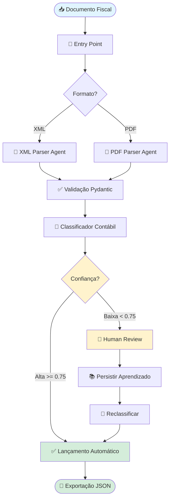

<div align="center">

## 🧾 Sistema de Extração de Dados Fiscais

### Arquitetura Multi-Agente Inteligente para Processamento Automatizado de NF-e

[](https://www.python.org/downloads/)
[](https://python.langchain.com/)
[](https://fastapi.tiangolo.com/)
[](https://streamlit.io/)
[](https://opensource.org/licenses/MIT)

**Transforme documentos fiscais em lançamentos contábeis através de inteligência artificial**

[Funcionalidades](#-funcionalidades) •
[Instalação](#-instalação) •
[Uso](#-uso) •
[Arquitetura](#-arquitetura-multi-agente) •
[Licença](#-licença)

</div>

---

## ✨ Funcionalidades

<table>
<tr>
<td width="50%">

### 🤖 **Sistema Multi-Agente**
- Orquestração inteligente via LangGraph
- Agentes especializados em parsing e classificação
- Workflow sequencial determinístico
- Estado compartilhado tipado e rastreável

</td>
<td width="50%">

### 📄 **Processamento Multi-Formato**
- Extração de XML (parsing direto)
- Extração de PDF/DANFE via LLM
- Suporte multi-provedor (OpenAI, Gemini, Groq)
- OCR automático para documentos escaneados

</td>
</tr>
<tr>
<td width="50%">

### 🔍 **Validação Rigorosa**
- Modelos Pydantic com tipagem forte
- Validação fiscal brasileira completa
- CFOP, NCM, CEST, CST/CSOSN
- Impostos ICMS, IPI, PIS, COFINS

</td>
<td width="50%">

### 🧮 **Classificação Contábil**
- Mapeamento automático de contas
- Determinação de débito/crédito
- Análise de natureza de operação
- Scoring de confiança baseado em regras

</td>
</tr>
<tr>
<td width="50%">

### 👤 **Human-in-the-Loop**
- Revisão humana para baixa confiança
- Interface integrada no Streamlit
- Aprendizado contínuo persistido
- Reprocessamento automático pós-revisão

</td>
<td width="50%">

### 🚀 **APIs e Interfaces**
- API REST completa com FastAPI
- Interface web moderna com Streamlit
- CLIs para processamento em lote
- Documentação OpenAPI/Swagger automática

</td>
</tr>
</table>

---

## 🏗 Arquitetura Multi-Agente

O sistema utiliza uma arquitetura sofisticada baseada em **LangGraph**, onde agentes especializados trabalham de forma coordenada para processar documentos fiscais e gerar classificações contábeis precisas.

### 🎯 Agentes Especializados

| Agente | Função | Responsabilidades |
|--------|--------|-------------------|
| 🔄 **XmlParserAgent** | Parsing de XML | Extração direta via xmltodict, validação de estrutura SEFAZ, normalização de campos |
| 📄 **PdfParserAgent** | Parsing de PDF | Extração de texto, OCR automático, análise via LLM multi-provedor, sanitização |
| 🧮 **ClassificadorContabilAgent** | Classificação Contábil | Mapeamento CFOP→Contas, determinação de natureza, scoring de confiança, fallback inteligente |

### 🔄 Fluxo do Workflow Sequencial



### 🛠️ Características do Workflow

- ✅ **Sequencial e Determinístico**: Mesma entrada produz sempre mesma saída
- ✅ **Estado Tipado**: TypedDict com Pydantic garantindo integridade
- ✅ **Multi-Formato**: XML (parsing direto) e PDF (LLM + OCR)
- ✅ **Rastreável**: Histórico completo com logs estruturados
- ✅ **Observável**: Estado compartilhado inspecionável via LangGraph
- ✅ **Resiliente**: Tratamento de erros em múltiplas camadas
- ✅ **Human-in-the-Loop**: Revisão integrada para casos de baixa confiança

---

## 📁 Estrutura do Projeto

```
agentes_contabeis/
├── 📄 README.md                    # Esta documentação
├── 📄 requirements.txt             # Dependências Python
├── 📄 pyproject.toml               # Configuração UV
├── 📄 run.bat                      # Automação de processamento em lote
├── 📄 .env                         # Variáveis de ambiente (criar manualmente)
│
├── 📂 src/
│   ├── 📂 agents/                  # 🤖 Agentes especializados
│   │   ├── xml_parser_agent.py     # Parsing direto de XML SEFAZ
│   │   ├── pdf_parser_agent.py     # Extração de PDF via LLM
│   │   └── classificador_contabil_agent.py # Classificação automática
│   │
│   ├── 📂 api/                    # 🌐 API REST
│   │   └── main.py                 # Endpoints FastAPI
│   │
│   ├── 📂 app/                    # 🖥️ Interfaces de usuário
│   │   ├── streamlit_app.py        # Interface web moderna
│   │   ├── run_graph.py            # CLI para workflow completo
│   │   ├── parse_cli.py            # CLI para parsing simples
│   │   └── test_all_pdfs.py        # Processamento em lote
│   │
│   ├── 📂 domain/                 # 📊 Modelos de dados
│   │   └── models.py               # Pydantic models (NFePayload, etc.)
│   │
│   ├── 📂 workflow/               # 🔄 Orquestração LangGraph
│   │   ├── graph.py                # Definição do workflow
│   │   ├── nodes.py                # Implementação dos nós
│   │   └── state.py                # Estado compartilhado tipado
│   │
│   └── 📂 utils/                  # 🔧 Utilitários
│       └── formatters.py           # Formatação brasileira
│
├── 📂 data/
│   └── 📂 exemplos/               # 📦 Dados de exemplo
│       ├── xml/                    # 7 XMLs de NF-e
│       └── pdf/                    # 5 PDFs de DANFE
│
├── 📂 data_sources/
│   └── contas_por_cfop.csv        # Mapeamento CFOP → Contas
│
├── 📂 tests/                      # ✅ Testes automatizados
│   ├── test_xml_parser.py         # Testes de parsing XML
│   ├── test_pdf_ie_destinatario.py # Validação de IE
│   └── test_csosn_cest.py         # Validação fiscal
│
└── 📂 logs/                       # 📝 Logs estruturados (auto-gerados)
```

---

## 🚀 Instalação

### Pré-requisitos

- **Python 3.10+** ([Download](https://www.python.org/downloads/))
- **UV** - Gerenciador moderno de dependências ([Instalação](https://docs.astral.sh/uv/))
- **Chave de API** de LLM (OpenAI, Google ou Groq)
- Opcional: **Tesseract OCR** para PDFs escaneados ([Download](https://github.com/UB-Mannheim/tesseract/wiki))

### Instalação Rápida com UV

```bash
# 1️⃣ Clone o repositório
git clone https://github.com/seu-usuario/ProjetoFinal_I2A2_ExtracaoDadosFiscais.git
cd agentes_contabeis

# 2️⃣ Crie ambiente virtual com UV
uv venv .venv

# 3️⃣ Ative o ambiente
# Windows PowerShell:
./.venv/Scripts/Activate.ps1

# Linux/Mac:
source .venv/bin/activate

# 4️⃣ Sincronize dependências
uv pip sync requirements.txt
```

### Configuração do `.env`

Crie um arquivo `.env` na raiz do projeto:

```ini
# Provedor de LLM (openai | gemini | groq)
PDF_LLM_PROVIDER=openai

# Chaves de API (configurar conforme provedor escolhido)
OPENAI_API_KEY=sk-proj-...
GOOGLE_API_KEY=AIza...
GROQ_API_KEY=gsk_...

# Modelo específico (opcional, usa defaults)
# openai: gpt-4o-mini | gpt-4o
# gemini: gemini-1.5-pro | gemini-1.5-flash
# groq: llama-3.1-70b-versatile | mixtral-8x7b-32768
PDF_LLM_MODEL=gpt-4o-mini

# Temperatura (0.0 = determinístico)
PDF_LLM_TEMPERATURE=0.0
```

---

## 💻 Uso

### Iniciando a Interface Web

```bash
# Inicia interface Streamlit
uv run streamlit run src/app/streamlit_app.py
```

A aplicação estará disponível em **http://localhost:8501**

### Iniciando a API REST

```bash
# Inicia servidor FastAPI
uv run uvicorn src.api.main:app --reload
```

API disponível em **http://localhost:8000**
Documentação interativa em **http://localhost:8000/docs**

### 📝 Como Usar a Interface Web

<table>
<tr>
<td width="30px">1️⃣</td>
<td><b>Configure o Backend</b><br/>Informe a URL da API na sidebar (padrão: http://localhost:8000)</td>
</tr>
<tr>
<td>2️⃣</td>
<td><b>Faça Upload</b><br/>Arraste um arquivo XML ou PDF para a área de upload</td>
</tr>
<tr>
<td>3️⃣</td>
<td><b>Analise</b><br/>Clique em "Analisar com IA" e aguarde o processamento</td>
</tr>
<tr>
<td>4️⃣</td>
<td><b>Visualize Resultados</b><br/>Navegue pelas abas (Visão Geral, Partes, Itens, Impostos, Dados Técnicos)</td>
</tr>
<tr>
<td>5️⃣</td>
<td><b>Revise (se necessário)</b><br/>Se confiança < 75%, preencha formulário de revisão humana</td>
</tr>
</table>

### 💡 Exemplos de Uso via CLI

```bash
# Parser simples de XML
uv run -m src.app.parse_cli --xml data/exemplos/xml/nfe_exemplo_1.xml

# Workflow completo (XML)
uv run -m src.app.run_graph --xml data/exemplos/xml/nfe_exemplo_1.xml --regime simples

# Workflow completo (PDF)
uv run -m src.app.run_graph --pdf data/exemplos/pdf/nfe_exemplo_1.pdf --regime simples

# Processamento em lote (todos arquivos de data/exemplos/)
./run.bat
```

### 🌐 Exemplos de Uso via API

**Classificar via Upload de XML**:
```bash
curl -X POST "http://localhost:8000/classificar/xml" \
  -F "xml_file=@data/exemplos/xml/nfe_exemplo_1.xml"
```

**Classificar via Upload de PDF**:
```bash
curl -X POST "http://localhost:8000/classificar/pdf" \
  -F "pdf_file=@data/exemplos/pdf/nfe_exemplo_1.pdf"
```

**Classificar via Caminho de Arquivo**:
```bash
curl -X POST "http://localhost:8000/classificar/path" \
  -H "Content-Type: application/json" \
  -d '{"xml_path": "data/exemplos/xml/nfe_exemplo_1.xml"}'
```

---

## 🛠 Desenvolvimento

### Setup de Desenvolvimento

```bash
# Instalar dependências de desenvolvimento
uv pip sync requirements.txt

# Instalar pré-commit hooks (recomendado)
uv pip install pre-commit
pre-commit install
```

### Testes

```bash
# Executar todos os testes
uv run -m pytest

# Com output detalhado
uv run -m pytest -v

# Testes específicos
uv run -m pytest tests/test_xml_parser.py

# Com cobertura de código
uv run -m pytest --cov=src --cov-report=html
```

---

## 🚢 Deploy

### Deploy Local

**API + Interface Web**:
```bash
# Terminal 1: Iniciar API
uv run uvicorn src.api.main:app --host 0.0.0.0 --port 8000

# Terminal 2: Iniciar Streamlit
uv run streamlit run src/app/streamlit_app.py --server.port 8501
```

### Deploy em Produção

#### Streamlit Cloud (Interface Web)

<table>
<tr>
<td width="30px">1️⃣</td>
<td>Faça push do código para o GitHub</td>
</tr>
<tr>
<td>2️⃣</td>
<td>Acesse <a href="https://streamlit.io/cloud">Streamlit Cloud</a></td>
</tr>
<tr>
<td>3️⃣</td>
<td>Conecte seu repositório GitHub</td>
</tr>
<tr>
<td>4️⃣</td>
<td>Configure as variáveis de ambiente no Streamlit Cloud Secrets</td>
</tr>
<tr>
<td>5️⃣</td>
<td>Clique em Deploy</td>
</tr>
</table>

---

## ⚙️ Configuração Avançada

| Variável | Descrição | Padrão | Obrigatório |
|----------|-----------|--------|-------------|
| `PDF_LLM_PROVIDER` | Provedor de LLM (openai, gemini, groq) | openai | ✅ |
| `OPENAI_API_KEY` | Chave da API OpenAI | - | ✅ (se provider=openai) |
| `GOOGLE_API_KEY` | Chave da API Google Gemini | - | ✅ (se provider=gemini) |
| `GROQ_API_KEY` | Chave da API Groq | - | ✅ (se provider=groq) |
| `PDF_LLM_MODEL` | Modelo específico do provedor | gpt-4o-mini | ❌ |
| `PDF_LLM_TEMPERATURE` | Temperatura do LLM (0.0-1.0) | 0.0 | ❌ |

---

## 🔒 Segurança

O sistema implementa múltiplas camadas de segurança e validação:

- ✅ **Validação de Entrada**: Pydantic valida todos os campos fiscais
- ✅ **Sanitização de Dados**: Normalização automática de CNPJ, CPF, valores
- ✅ **Validação Fiscal**: CFOP (4 dígitos), NCM (8 dígitos), CEST (7 dígitos)
- ✅ **Tratamento de Erros**: Captura granular com logs estruturados
- ✅ **Rastreabilidade**: Estado compartilhado com histórico completo

---

## 📊 Casos de Uso

### Caso 1: Processamento Automático de NF-e XML
**Entrada**: XML de venda interestadual (SP→RJ), CFOP 5102, valor R$ 1.500,00
**Processamento**: Parser XML → Validação Pydantic → Classificador → Confiança 90%
**Saída**: Débito: Clientes / Crédito: Receita de Vendas (automático)

### Caso 2: Extração de PDF via LLM
**Entrada**: PDF do DANFE sem camada de texto (escaneado)
**Processamento**: PyMuPDF → OCR (Tesseract) → LLM (GPT-4o-mini) → Sanitização → Validação
**Saída**: NFePayload estruturado idêntico ao XML

### Caso 3: Revisão Humana (CFOP Não Mapeado)
**Entrada**: NF-e com CFOP 6949 (não cadastrado)
**Processamento**: Parser → Classificador (fallback) → Confiança 50% → `needs_review=True`
**Interação**: Interface mostra formulário → Usuário classifica manualmente
**Aprendizado**: Sistema persiste no CSV → Próximas NF-es com 6949 são automáticas

---

## 🤝 Contribuindo

Contribuições são bem-vindas! Para contribuir:

1. Faça fork do projeto
2. Crie uma branch para sua feature (`git checkout -b feature/NovaFuncionalidade`)
3. Commit suas mudanças (`git commit -m 'Adiciona nova funcionalidade'`)
4. Push para a branch (`git push origin feature/NovaFuncionalidade`)
5. Abra um Pull Request

---

## 📄 Licença

Este projeto está licenciado sob a **Licença MIT** - uma das licenças de software livre mais permissivas e amplamente utilizadas.

### 🎯 O que você pode fazer com este software:

<table>
<tr>
<td width="50%">

#### ✅ **Uso Comercial**
- Usar o software em projetos comerciais
- Integrar em produtos proprietários
- Oferecer como serviço (SaaS)
- Monetizar soluções baseadas neste código

</td>
<td width="50%">

#### ✅ **Modificação**
- Modificar o código-fonte livremente
- Adaptar para suas necessidades específicas
- Criar versões customizadas
- Melhorar e estender funcionalidades

</td>
</tr>
<tr>
<td width="50%">

#### ✅ **Distribuição**
- Redistribuir cópias do software
- Compartilhar versões modificadas
- Publicar em repositórios públicos ou privados
- Incluir em pacotes de software

</td>
<td width="50%">

#### ✅ **Uso Privado**
- Usar internamente em sua organização
- Modificar sem obrigação de compartilhar
- Manter alterações proprietárias
- Executar em ambientes corporativos

</td>
</tr>
</table>

### 📋 Requisitos da Licença MIT:

- **Incluir o aviso de copyright**: Manter o aviso de copyright original em todas as cópias ou porções substanciais do software
- **Incluir a licença MIT**: Distribuir cópias do texto da licença junto com o software
- **Não usar para endosso**: Não usar nomes dos autores originais para promover produtos derivados sem permissão

### ⚠️ Isenção de Garantia:

O software é fornecido **"como está"**, sem garantias de qualquer tipo, expressas ou implícitas. Os autores ou detentores dos direitos autorais não são responsáveis por quaisquer reivindicações, danos ou outras responsabilidades decorrentes do uso do software.

---

### 📜 Licença MIT

```
MIT License

Copyright (c) 2025 Agente Aprende - Pedro Markovicz

Permission is hereby granted, free of charge, to any person obtaining a copy
of this software and associated documentation files (the "Software"), to deal
in the Software without restriction, including without limitation the rights
to use, copy, modify, merge, publish, distribute, sublicense, and/or sell
copies of the Software, and to permit persons to whom the Software is
furnished to do so, subject to the following conditions:

The above copyright notice and this permission notice shall be included in all
copies or substantial portions of the Software.

THE SOFTWARE IS PROVIDED "AS IS", WITHOUT WARRANTY OF ANY KIND, EXPRESS OR
IMPLIED, INCLUDING BUT NOT LIMITED TO THE WARRANTIES OF MERCHANTABILITY,
FITNESS FOR A PARTICULAR PURPOSE AND NONINFRINGEMENT. IN NO EVENT SHALL THE
AUTHORS OR COPYRIGHT HOLDERS BE LIABLE FOR ANY CLAIM, DAMAGES OR OTHER
LIABILITY, WHETHER IN AN ACTION OF CONTRACT, TORT OR OTHERWISE, ARISING FROM,
OUT OF OR IN CONNECTION WITH THE SOFTWARE OR THE USE OR OTHER DEALINGS IN THE
SOFTWARE.
```

---

Este modelo de licenciamento promove:
- **Adoção ampla** da solução de automação contábil com IA
- **Colaboração** entre desenvolvedores, empresas e comunidade acadêmica
- **Transparência** no desenvolvimento de sistemas fiscais e contábeis
- **Confiança** através de código auditável e verificável

### 🎓 Mais informações sobre a Licença MIT

- [Open Source Initiative - MIT License](https://opensource.org/licenses/MIT)
- [Choose a License - MIT](https://choosealicense.com/licenses/mit/)
- [TLDRLegal - MIT License Explained](https://www.tldrlegal.com/license/mit-license)

---

<div align="center">

**Desenvolvido com ❤️ usando Python, IA e uma boa dose de café ☕**

**Grupo: Agente Aprende**

[](https://github.com/PedroMarkovicz)
[](https://www.linkedin.com/in/pedro-markovicz/)

[⬆ Voltar ao topo](#-sistema-de-extração-de-dados-fiscais)
