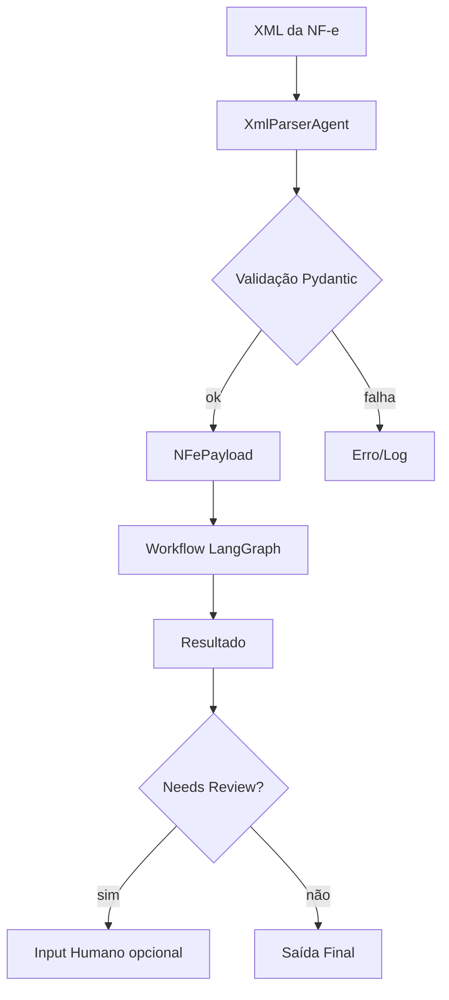

## Agentes Contábeis — NF‑e Parser, Classificação e UI

[](https://www.python.org/)
[](https://fastapi.tiangolo.com/)
[](https://streamlit.io/)
[](https://github.com/astral-sh/uv)
[](https://pytest.org/)

Plataforma em Python para ler NF‑e (XML), extrair um `NFePayload` validado com Pydantic, executar um fluxo com LangGraph, expor endpoints FastAPI e disponibilizar uma UI moderna em Streamlit. Inclui CLIs, exemplos de XML e automação via `run.bat`.

---

### Sumário
- [Destaques](#destaques)
- [Arquitetura (visão rápida)](#arquitetura-visão-rápida)
- [Quick Start](#quick-start)
- [Instalação (uv)](#instalação-uv)
- [Como executar](#como-executar)
- [Estrutura do projeto](#estrutura-do-projeto)
- [Schema de dados](#schema-de-dados)
- [Automação Windows](#automação-windows)
- [Logs e troubleshooting](#logs-e-troubleshooting)
- [Publicar no GitHub](#publicar-no-github)

---

### Destaques
- **Parser NF‑e robusto**: uso de `xmltodict` + sanitização pré‑validação.
- **Modelos Pydantic**: validação clara de `NFePayload` e `NFeItem`.
- **Fluxo LangGraph**: estado tipado e execução determinística.
- **API + UI**: integração FastAPI e Streamlit com experiência aprimorada.
- **DX**: `uv` para ambientes rápidos e `pytest` para testes.

---

### Arquitetura (visão rápida)


---

## Quick Start
1) Crie a venv e instale dependências (usando `uv`):
```powershell
uv venv .venv; ./.venv/Scripts/Activate.ps1; uv pip sync requirements.txt
```
2) Rode os testes:
```powershell
uv run -m pytest -q
```
3) Suba API e UI (em dois terminais):
```powershell
uv run uvicorn src.api.main:app --reload
uv run streamlit run src/app/streamlit_app.py
```

---

## Instalação (uv)
Requisitos: Python 3.10+, Git, PowerShell (para `run.bat`).

Instale o `uv` se necessário:
```powershell
pip install uv
```

Crie ambiente e sincronize:
```powershell
uv venv .venv
./.venv/Scripts/Activate.ps1
uv pip sync requirements.txt
```

Atualize dependências após editar `requirements.txt`:
```powershell
uv pip sync requirements.txt
```

---

## Como executar

| Tarefa | Comando |
|---|---|
| Testes | `uv run -m pytest -q` |
| Parser simples (CLI) | `uv run -m src.app.parse_cli --xml data/exemplos/nota_minima.xml` |
| Workflow LangGraph | `uv run -m src.app.run_graph --xml data/exemplos/nota_minima.xml --log-level info` |
| Informar regime (opcional) | `--regime simples` (não use `*`) |
| Revisão humana (opcional) | `--human-review-json caminho\revisao.json` |
| API FastAPI | `uv run uvicorn src.api.main:app --reload` |
| UI Streamlit | `uv run streamlit run src/app/streamlit_app.py` |

No painel lateral da UI, configure a URL do backend (ex.: `http://127.0.0.1:8000`) e clique em “Testar”.

---

## Estrutura do projeto
```text
.
├─ src/
│  ├─ agents/
│  │  ├─ xml_parser_agent.py
│  │  └─ classificador_contabil_agent.py
│  ├─ api/
│  │  └─ main.py
│  ├─ app/
│  │  ├─ parse_cli.py
│  │  ├─ run_graph.py
│  │  └─ streamlit_app.py
│  └─ workflow/
│     ├─ graph.py
│     ├─ nodes.py
│     └─ state.py
├─ data/
│  └─ exemplos/
├─ data_sources/
│  └─ contas_por_cfop.csv
├─ requirements.txt
├─ run.bat
└─ .gitignore
```

---

## Schema de dados
`NFePayload` (mínimo):

| Campo | Tipo | Descrição |
|---|---|---|
| `cfop` | `str` (4 dígitos) | CFOP da operação |
| `emitente_uf` | `UF` | UF do emitente (`SP`, `RJ`, `MG`, `ES`, `OUTRO`) |
| `destinatario_uf` | `UF` | UF do destinatário |
| `valor_total` | `float` | Valor total da NF‑e (≥ 0) |
| `itens` | `List[NFeItem]` | Itens com `descricao`, `ncm`, `valor` |

Notas:
- `ncm` inválido é sanitizado para `None` antes da validação.
- Acesso seguro a dicionários com `safe_get`.

---

## Automação Windows
Execute:
```powershell
./run.bat
```
O script:
- Busca XMLs em `data/exemplos/` (recursivo)
- Executa o workflow para cada arquivo
- Salva logs/JSONs em `logs/`
- Gera `logs/summary.csv` (`ok`, `needs_review`, `reason`)
- Inicia loop de revisão humana quando necessário (sem CFOP; pergunta regime/contas)

---

## Logs e troubleshooting
- Ajuste o nível com `--log-level` nos CLIs (ex.: `debug`, `info`).
- Se faltar dependência no `pytest` (ex.: `pluggy`), rode `uv pip sync requirements.txt`.
- No `run.bat`, pipes `|` e parênteses estão escapados (PowerShell).
- Se mudar a porta do backend, atualize a URL na UI.

---

## Publicar no GitHub
Com GitHub CLI:
```powershell
git init -b main
git add -A
git commit -m "chore: initial commit"
gh repo create Agentes_Contabeis --private --source . --remote origin --push
```

Manual (repo vazio no site):
```powershell
git init -b main
git add -A
git commit -m "chore: initial commit"
git remote add origin https://github.com/SEU_USUARIO/Agentes_Contabeis.git
git push -u origin main
```

---

## Licença
Defina a licença (ex.: MIT) ou mantenha como proprietária.

---

## Suporte
Abra uma issue com detalhes (inclua logs e o XML se possível) ou ajuste o nível de log para coletar mais contexto durante a execução.


